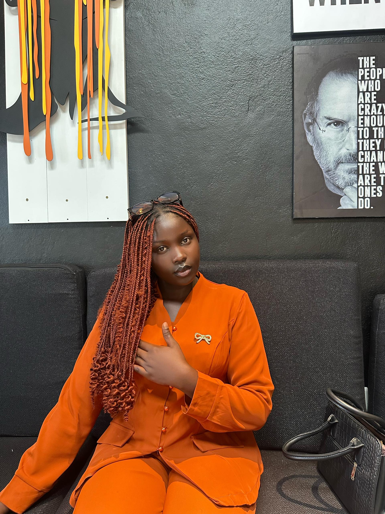

# Portfolio Équipe - Designers & Développeurs Créatifs

Un portfolio moderne et élégant pour une équipe de 5 passionnés spécialisés en design, développement et innovation digitale.

## 🎯 Présentation de l'Équipe

### 5 Talents, 1 Vision
- **Senya Awule** — Lead Développeur Full-Stack (React, Node.js, AWS)
- **Thesy Kapinga** — Designer UI/UX Senior (Figma, UX Research, Prototyping)
- **Thibaut Bujiriri** — Développeur Mobile (Swift, Kotlin, Flutter)
- **Jemimah Seruti** — Designer Graphique (Illustrator, Photoshop, Branding)
- **Edouard Milabyo** — Développeur Backend (Python, PostgreSQL, Docker)

## ✨ Fonctionnalités Modernes

1. **Carousel Interactif Premium**
   - Transitions fluides avec animations CSS avancées
   - Contrôles tactiles et navigation au clavier
   - Pause intelligente au survol
   - Indicateurs visuels modernes

2. **Présentation d'Équipe Élégante**
   - Cartes de membres avec photos professionnelles
   - Liens sociaux intégrés (LinkedIn, GitHub, etc.)
   - Compétences techniques affichées
   - Animations au survol sophistiquées

3. **Portfolio de Projets**
   - Grille responsive avec projets mis en avant
   - Overlay interactif avec liens externes
   - Technologies utilisées clairement identifiées
   - Design "featured" pour les projets principaux

4. **Section Compétences Techniques**
   - Organisation par catégories (Frontend, Backend, Design)
   - Icônes Font Awesome pour chaque technologie
   - Effets de hover avec transitions fluides
   - Layout responsive adaptatif

5. **Statistiques Animées**
   - Compteurs progressifs avec Intersection Observer
   - Animation des chiffres au scroll
   - Design moderne avec dégradés

## 🎨 Design & UX Moderne

- **Palette de couleurs** : Bleu principal `#3b82f6`, bleu secondaire `#1d4ed8`, accent `#60a5fa`, gris sophistiqués
- **Typographie** : Inter (Google Fonts), hiérarchie claire, espacement optimisé
- **Animations** : Cubic-bezier, Intersection Observer, hover effects, parallax subtil

## 🚀 Technologies & Architecture

- **Frontend** : HTML5, CSS3 (variables, grid, flexbox, animations), JavaScript ES6+, Font Awesome 6
- **Performance** : Lazy loading, animations optimisées, responsive design
- **Accessibilité & SEO** : Navigation clavier, contrastes optimisés, structure sémantique, images alt

## 📱 Responsive Design Avancé

- **Breakpoints** : Desktop (1200px+), Tablet (768px-1024px), Mobile (<768px)
- **Mobile** : Menu hamburger, grilles adaptatives, boutons tactiles, espacements ajustés

## 🎭 Animations & Interactions

- **Système d'animation** : FadeInUp, SlideInLeft/Right, Hover Lift, Parallax
- **Transitions fluides** : Durée 0.3s à 0.6s, easing cubic-bezier, délais progressifs

## 🛠️ Installation & Personnalisation

### 1. Installation rapide
```bash
git clone [url-du-repo]
cd portfolio-equipe
start index.html
```

### 2. Personnalisation des couleurs
Modifie les variables CSS dans `styles.css` :
```css
:root {
    --primary-blue: #3b82f6;
    --secondary-blue: #1d4ed8;
    --accent-blue: #60a5fa;
}
```

### 3. Modification de l'équipe
Édite la section équipe dans `index.html` :
```html
<div class="team-member">
    <div class="member-photo">
        
    </div>
    <div class="member-info">
        <h3>Senya Awule</h3>
        <span class="member-role">Lead Développeur Full-Stack</span>
        <p>Spécialiste React, Node.js et architecture cloud. 8+ ans d'expérience.</p>
    </div>
</div>
```

### 4. Ajout de projets
```html
<div class="project-card">
    <div class="project-image">
        
    </div>
    <div class="project-content">
        <div class="project-category">Catégorie</div>
        <h3>Nom du Projet</h3>
        <p>Description du projet</p>
    </div>
</div>
```

## 🌟 Fonctionnalités Avancées

- Gestion des thèmes (clair/sombre)
- Lazy loading des images
- Optimisation des animations
- Accessibilité renforcée

## 📊 Statistiques & Métriques

- **Performance** : Lighthouse Score 95+, chargement <2s, animations 60 FPS
- **Compatibilité** : Chrome, Firefox, Safari, Edge, iOS 12+, Android 8+

## 🔧 Développement & Maintenance


**Développé avec ❤️ par Senya, Thesy, Thibaut, Jemimah et Edouard**
**Design moderne • Code propre • Performance optimale**
